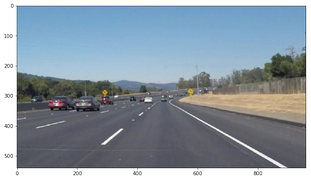
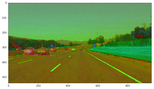
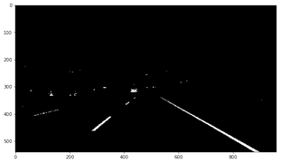
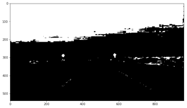
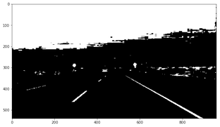
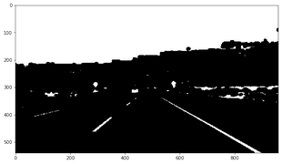
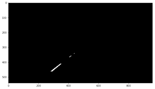
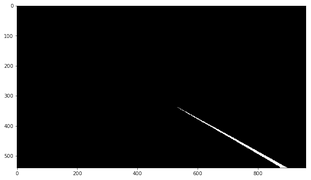
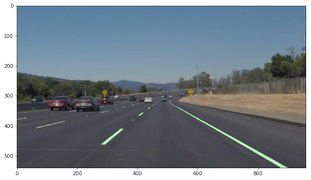
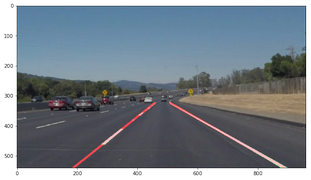

# **Finding Lane Lines on the Road** 

## Pipeline description

### Project goals

* Make a pipeline that finds lane lines on the road
* Reflect on your work in a written report

---

### Introduction

I started with the recomended pipeline - grayscale, hough transform, average lines, but I wasn't satisfied with the results in the challenge.mp4 video

I experimented with few approaches - standard Hough transform instead of probabilistic one, different color spaces,  etc. In the end, I've decided to go with thresholding in HLS colorspace and linear regression for line equation extraction.

Disclaimer: My pipeline does not return list of lines, since I am not performing Hough transform.

### Pipeline.
Example image:

1. Convert the image from RGB to HLS colorspace.

    

2. Segment the lane markings.
  1. Usually the white and yellow are the brightest colors in the image and we can just threshold for high values in _lightness_ component.
  
        

  2. But I ran into trouble with yellow detection in dark or very light images. So another branch just for yellow is needed. We threshold in _saturation_ component, but we also assume that the lane is fairly bright, so we demand _lightness_ to be over certain value. (There are no yellow lanes on the example image, but you can see that the yellow road signs were selected.)

        

  3. Combine the two filters with `or` operator.

        

3. Morphological operation _Closing_ is performed to get rid of small holes in the detected lanes.

	 

4. Keep only region of interest. The detection area is defined with a trapezoid with following vortices:
  * lower left corner
  * lower right corner
  * lower 40% of image height, 55% of image width
  * lower 40% of image height, 45% of image width

    

5. Now that we have segmented the lane markings, it is time to find the line equation representing the lane marking on each side.

    My naive assupmtion is that the left line will be located on the left side of the image, so I mask the right side out.

    

6. Since we are looking for linear equation, I have decided to use RANSAC linear regression model from scipy library. This model should mitigate the effect of possible outliers in the data. After fitting the model with the data, values for the lower edge of the image and the top of region of interest are predicted. These values are then send to draw_lines function to display the line.

7. Same process is repeated for the right lane.

    

8. Highlighted detected roadmarks.

    

9. Final output - extracted lane lines.

    

### Shortcomings of my current pipeline and ideas for improvement

* varying illumination of the scene
  * adaptive thresholding
  * better tuning of thresholds

* jerky behavior in videos
  * implement memory of past lanes
  * assume that new lane position shall not move much in respect to the old one

* lanes outside of the region of interest (e.g. crossing lanes, driving up/downhill, etc.)
  * develop another method for selecting ROI

* detection of curved lanes
  * generelized Hough transform for parabolas or higher order polynomes
  * or parabolic regression 

* computation time
  * comparison of hough transform and linear regression execution time
  * try to get to real time execution capability 

 
